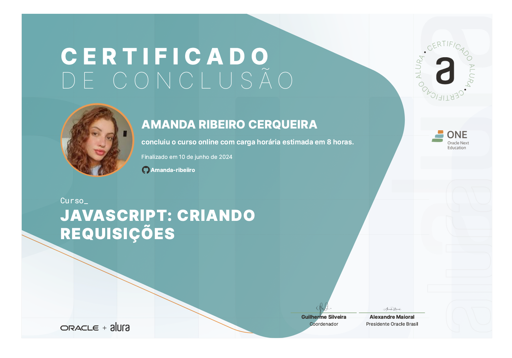

    
    

 
 

    

 

  

    

 

  <h1><a href="https://cursos.alura.com.br/course/javascript-criando-requisicoes">JavaScript: criando requisições</a></h1>
      <table align="center">
        <thead>
          <tr>
            <th>Curso</th>
            <th>Prazo</th>
            <th>Curso</th>
            <th>Modulos</th>
            <th>Carga Horária</th>
          </tr>
        </thead>
        <tbody>
          <tr>
            <td>Simulando uma API</td>
            <td align=center>16/07/24</td>
            <td align="center"><a href="https://cursos.alura.com.br/course/javascript-criando-requisicoes/section/14425/tasks" target="_blank">acesso</a></td>
            <td align="center">11</td>
            <td align="center">14min</td>
          </tr>
          <tr>
            <td>Exibindo elementos</td>
            <td align=center>16/07/24</td>
            <td align="center"><a href="https://cursos.alura.com.br/course/javascript-criando-requisicoes/section/14426/tasks" target="_blank">acesso</a></td>
            <td align="center">10</td>
            <td align="center">25min</td>
          </tr>
          <tr>
            <td>Criando novos elementos</td>
            <td align=center>16/07/24</td>
            <td align="center"><a href="https://cursos.alura.com.br/course/javascript-criando-requisicoes/section/14427/tasks" target="_blank">acesso</a></td>
            <td align="center">9</td>
            <td align="center">21min</td>
          </tr>
          <tr>
            <td>Buscando elementos</td>
            <td align=center>16/07/24</td>
            <td align="center"><a href="https://cursos.alura.com.br/course/javascript-criando-requisicoes/section/14428/tasks" target="_blank">acesso</a></td>
            <td align="center">9</td>
            <td align="center">20min</td>
          </tr>
          <tr>
            <td>Lidando com erros</td>
            <td align=center>16/07/24</td>
            <td align="center"><a href="https://cursos.alura.com.br/course/javascript-criando-requisicoes/section/14429/tasks" target="_blank">acesso</a></td>
            <td align="center">12</td>
            <td align="center">14min</td>
          </tr>
        </tbody>
      </table>

 
 

    

        <button style="padding: 10px 20px; background-color: #AB7AD6; color: #FFF; border: none; border-radius: 5px; box-shadow: 0px 2px 2px rgba(0,0,0,0.3); transition: box-shadow 0.3s ease;" onclick="this.style.boxShadow='inset 0px 2px 2px rgba(0,0,0,0.3)'">Certificado
        </button>
    

     
        

            
        

